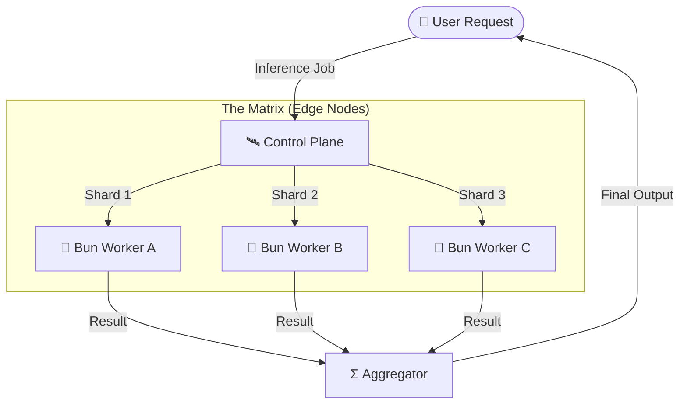

# 🏗️ System Architecture

## 1. High-Level Design (HLD)

EdgeMatrix is a **Distributed WASM Runtime** for AI Inference. It replaces heavy Python containers with lightweight **Bun + WebAssembly** workers, allowing models to run "at the edge" (IoT, Browser, Cloudflare Workers) with near-native performance.

### Core Components
1.  **Control Plane**: TypeScript orchestrator that splits models (e.g., Llama layers) into shards.
2.  **Bun Worker**: A lightweight runtime (starts in <4ms) that loads compiled WASM kernels.
3.  **WASM Kernel**: C++ code compiled to WebAssembly for heavy matrix multiplication (GEMM).
4.  **ONNX/GGUF Loader**: Parsers for loading quantized model weights into shared memory.

---

## 2. Low-Level Design (LLD)

### Data Flow: The "Zero-Copy" Execution
Traditional JS bridges copy data between JS Heap and C++ Heap (slow). EdgeMatrix uses `SharedArrayBuffer` for zero-copy transfers.

1.  **Load**: Control Plane maps the Model Weights file into memory.
2.  **Scatter**: Pointers to memory regions are sent to Workers via `postMessage`.
3.  **Compute**:
    *   Bun invokes the WASM function `run_inference(ptr_input, ptr_weights, ptr_output)`.
    *   WASM executes SIMD instructions directly on the buffer.
4.  **Gather**: Results are read back from the buffer without serialization overhead.

### Tech Stack Choices
*   **Bun**: Chosen over Node.js for its 3x faster startup and native C-interop (FFI).
*   **WASM**: Chosen over Docker containers for security (sandboxed) and portability (runs on Vercel/Cloudflare).

---

## 3. Decision Log

| Decision | Alternative | Reason for Choice |
| :--- | :--- | :--- |
| **Bun (Zig/JS)** | Node.js (V8) | **Startup Speed**. Edge functions must cold-start in <10ms. Node takes ~100ms. Bun takes ~4ms. |
| **ONNX Runtime** | TensorFlow | **Portability**. ONNX is the standard for "Write Once, Run Anywhere". TF is too heavy for edge. |
| **Int8 Quantization** | Float32 | **Memory**. Edge devices have 4GB RAM. Int8 reduces a 7B model from 28GB to 7GB. |

---

## 4. Key Patterns

### "Model Sharding"
A single Edge Node cannot run LLama-70B.
*   **Strategy**: We interpret the Transformer layers.
*   **Layer 1-10**: Sent to Node A.
*   **Layer 11-20**: Sent to Node B.
*   **Pipeline Parallelism**: Data flows A -> B -> C. Latency increases, but Throughput is massive.
